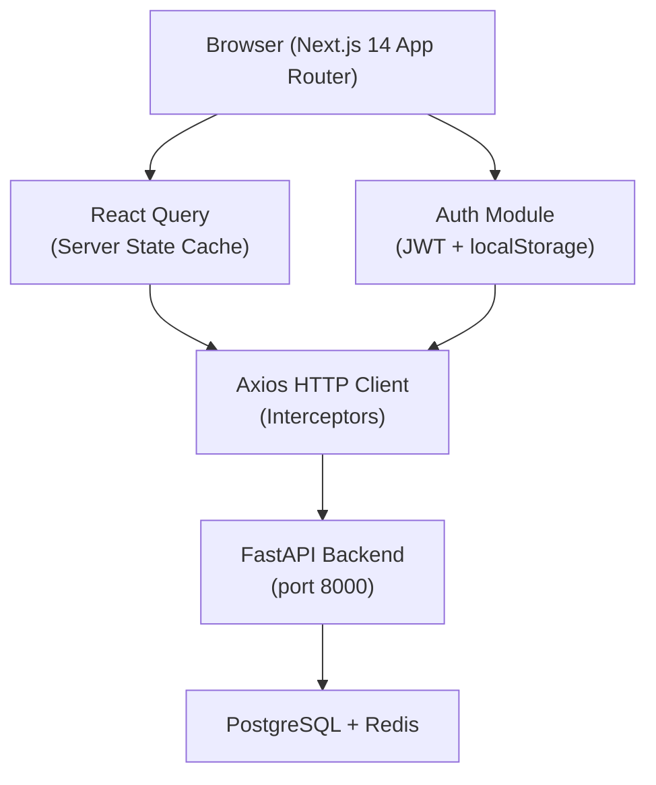
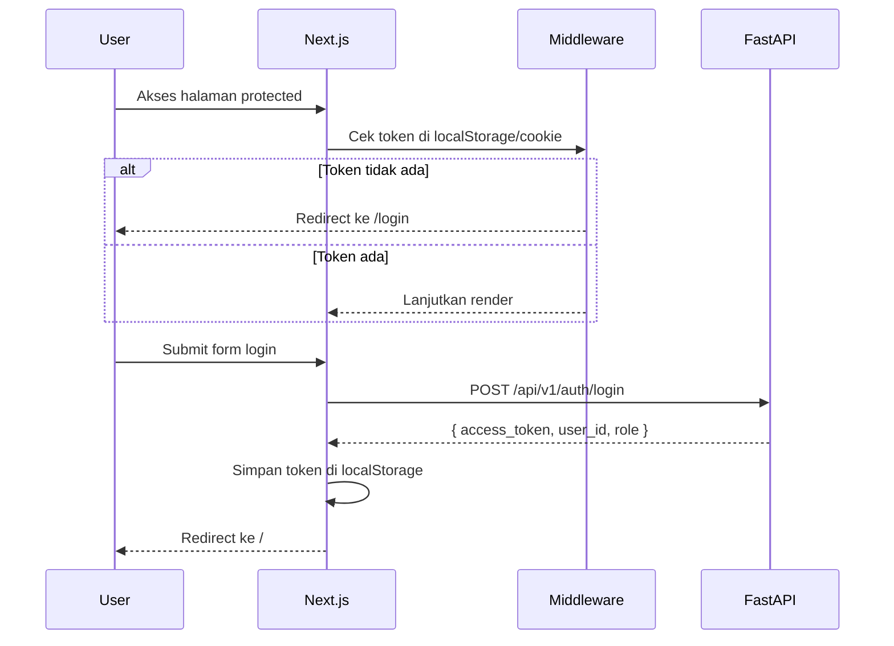
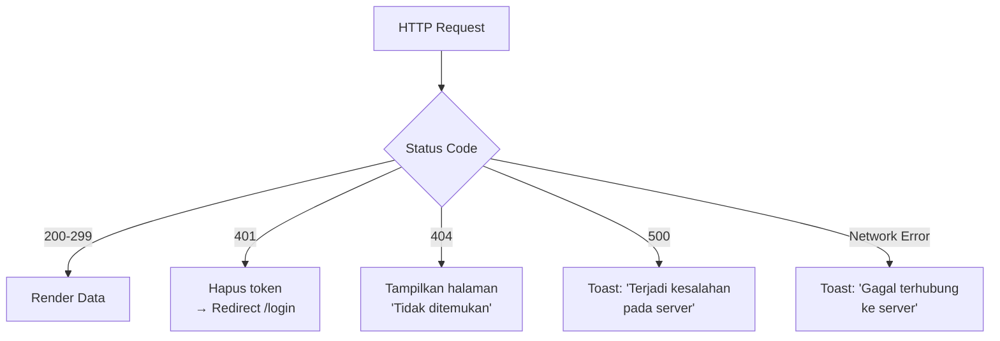

# Dokumen Desain Teknis: Influencer Dashboard UI

## Ikhtisar

Dashboard UI adalah aplikasi frontend Next.js 14 (App Router) yang mengonsumsi REST API FastAPI yang sudah berjalan di port 8000. Aplikasi ini menyediakan antarmuka visual untuk memantau performa influencer/affiliator TikTok, metrik kampanye, dan laporan GMV.

Desain mengikuti paradigma dark mode bergaya Vercel/Linear — minimalis, padat informasi, dan responsif. Autentikasi menggunakan JWT token yang diterima dari backend dan disimpan di `localStorage` (dengan pertimbangan keamanan XSS yang dimitigasi melalui interceptor Axios).

**Tujuan utama:**
- Konsumsi API backend yang sudah ada tanpa modifikasi backend
- Rendering data real-time dengan React Query (TanStack Query)
- Komponen yang dapat digunakan ulang dan mudah diuji
- Navigasi berbasis App Router Next.js 14

---

## Arsitektur

### Gambaran Umum Sistem



### Struktur Folder Proyek

```
dashboard/
├── src/
│   ├── app/                        # Next.js App Router
│   │   ├── (auth)/
│   │   │   └── login/
│   │   │       └── page.tsx
│   │   ├── (dashboard)/
│   │   │   ├── layout.tsx          # Layout dengan Sidebar
│   │   │   ├── page.tsx            # Dashboard utama (/)
│   │   │   ├── influencers/
│   │   │   │   ├── page.tsx        # Daftar influencer
│   │   │   │   └── [id]/
│   │   │   │       └── page.tsx    # Detail influencer
│   │   │   ├── campaigns/
│   │   │   │   └── page.tsx        # Daftar kampanye
│   │   │   └── reports/
│   │   │       └── page.tsx        # Laporan GMV & ROI
│   │   ├── not-found.tsx
│   │   └── layout.tsx              # Root layout
│   ├── components/
│   │   ├── ui/                     # shadcn/ui primitives
│   │   ├── MetricCard.tsx
│   │   ├── GMVChart.tsx
│   │   ├── InfluencerTable.tsx
│   │   ├── RankBadge.tsx
│   │   ├── StatusIndicator.tsx
│   │   ├── Sidebar.tsx
│   │   └── Toast.tsx
│   ├── lib/
│   │   ├── api-client.ts           # Axios instance + interceptors
│   │   ├── auth.ts                 # Token helpers
│   │   └── formatters.ts           # Format angka, tanggal, mata uang
│   ├── hooks/
│   │   ├── useAuth.ts
│   │   ├── useAffiliates.ts
│   │   ├── useCampaigns.ts
│   │   └── useReports.ts
│   ├── types/
│   │   └── api.ts                  # TypeScript types dari API response
│   └── middleware.ts               # Route protection
├── package.json
├── tailwind.config.ts
├── next.config.ts
└── tsconfig.json
```

### Alur Autentikasi



---

## Komponen dan Antarmuka

### 1. API Client (`lib/api-client.ts`)

Instance Axios tunggal dengan interceptors untuk:
- Menyisipkan `Authorization: Bearer <token>` pada setiap request
- Menangani response 401 → hapus token + redirect ke `/login`
- Menangani response 500 → trigger toast error global

```typescript
// Kontrak interface
interface ApiClient {
  get<T>(url: string, params?: Record<string, unknown>): Promise<T>
  post<T>(url: string, data?: unknown): Promise<T>
}
```

### 2. MetricCard

Kartu metrik tunggal dengan skeleton loading state.

```typescript
interface MetricCardProps {
  title: string
  value: string | number
  subtitle?: string
  isLoading?: boolean
  icon?: React.ReactNode
}
```

### 3. GMVChart

Komponen Recharts yang mendukung mode harian/mingguan/bulanan.

```typescript
type ChartMode = 'daily' | 'weekly' | 'monthly'

interface GMVChartProps {
  data: { date: string; gmv: number }[]
  mode: ChartMode
  onModeChange: (mode: ChartMode) => void
  isLoading?: boolean
}
```

### 4. InfluencerTable

Tabel dengan sorting client-side dan navigasi ke detail.

```typescript
type SortField = 'follower_count' | 'engagement_rate' | 'gmv_total'
type SortDirection = 'asc' | 'desc'

interface InfluencerTableProps {
  data: AffiliateCardResponse[]
  isLoading?: boolean
  onRowClick: (id: string) => void
  sortField: SortField
  sortDirection: SortDirection
  onSort: (field: SortField) => void
}
```

### 5. StatusIndicator

Badge warna berdasarkan status kampanye.

```typescript
type CampaignStatus = 'ACTIVE' | 'DRAFT' | 'PAUSED' | 'STOPPED' | 'COMPLETED'

interface StatusIndicatorProps {
  status: CampaignStatus
}
// Mapping warna: ACTIVE=hijau, DRAFT=abu-abu, PAUSED=kuning, STOPPED=merah, COMPLETED=biru
```

### 6. RankBadge

```typescript
interface RankBadgeProps {
  rank: number
  // rank 1-3: emas, 4-10: perak, >10: abu-abu
}
```

### 7. Sidebar

```typescript
interface SidebarProps {
  currentPath: string
}
// Links: /, /influencers, /campaigns, /reports
```

---

## Model Data

### TypeScript Types (dari API Response)

```typescript
// types/api.ts

export interface LoginResponse {
  access_token: string
  token_type: string
  user_id: string
  role: string
}

export interface AffiliateCardResponse {
  id: string
  name: string
  photo_url: string | null
  follower_count: number
  engagement_rate: number
  content_categories: string[]
  location: string
  has_whatsapp: boolean
}

export interface PaginatedAffiliateResponse {
  items: AffiliateCardResponse[]
  total: number
  page: number
  page_size: number
}

export interface AffiliateDetailResponse {
  id: string
  name: string
  photo_url: string | null
  follower_count: number
  engagement_rate: number
  content_categories: string[]
  location: string
  bio: string | null
  phone_number: string | null
  contact_channel: string
  whatsapp_collection_status: string | null
  tiktok_profile_url: string | null
}

export interface CampaignResponse {
  id: string
  name: string
  description: string
  status: 'DRAFT' | 'ACTIVE' | 'PAUSED' | 'COMPLETED'
  start_date: string
  end_date: string
  created_by: string
  created_at: string
  updated_at: string
}

export interface CampaignReportResponse {
  campaign_id: string
  total_influencers: number
  acceptance_rate: number
  total_views: number
  total_gmv: number
  cost_per_conversion: number
  generated_at: string
}

export interface GMVDataPoint {
  date: string
  gmv: number
}

// State lokal untuk filter influencer
export interface InfluencerFilters {
  min_followers?: number
  max_followers?: number
  min_engagement_rate?: number
  categories?: string[]
  locations?: string[]
  page: number
  page_size: number
}
```

### Pemetaan Endpoint API

| Halaman / Komponen | Method | Endpoint |
|---|---|---|
| Login | POST | `/api/v1/auth/login` |
| Logout | POST | `/api/v1/auth/logout` |
| Dashboard metrics | GET | `/api/v1/reports/campaigns` |
| Daftar influencer | GET | `/api/v1/affiliates/search` |
| Detail influencer | GET | `/api/v1/affiliates/{id}` |
| Daftar kampanye | GET | `/api/v1/campaigns/{id}` |
| Laporan kampanye | GET | `/api/v1/campaigns/{id}/report` |
| Semua laporan | GET | `/api/v1/reports/campaigns` |
| Ekspor laporan | POST | `/api/v1/reports/export` |

### React Query Keys

```typescript
export const queryKeys = {
  reports: ['reports', 'campaigns'] as const,
  affiliates: (filters: InfluencerFilters) => ['affiliates', filters] as const,
  affiliateDetail: (id: string) => ['affiliates', id] as const,
  campaignReport: (id: string) => ['campaigns', id, 'report'] as const,
}
```

---

## Properti Kebenaran (Correctness Properties)

*Properti adalah karakteristik atau perilaku yang harus berlaku di semua eksekusi sistem yang valid — pada dasarnya, pernyataan formal tentang apa yang seharusnya dilakukan sistem. Properti berfungsi sebagai jembatan antara spesifikasi yang dapat dibaca manusia dan jaminan kebenaran yang dapat diverifikasi secara otomatis.*

### Properti 1: Token disertakan pada setiap request terautentikasi

*Untuk setiap* permintaan HTTP yang dibuat oleh API client setelah login berhasil, header `Authorization: Bearer <token>` harus selalu ada dan berisi token yang valid.

**Memvalidasi: Persyaratan 1.5**

---

### Properti 2: Redirect ke login saat tidak terautentikasi

*Untuk setiap* halaman yang memerlukan autentikasi, jika tidak ada token yang tersimpan, pengguna harus selalu diarahkan ke `/login` tanpa mengekspos konten halaman tersebut.

**Memvalidasi: Persyaratan 1.1**

---

### Properti 3: Pesan error 401 tidak mengungkap detail teknis

*Untuk setiap* respons 401 dari endpoint login, pesan yang ditampilkan ke pengguna harus selalu berupa string yang tidak mengandung stack trace, nama field database, atau informasi teknis internal.

**Memvalidasi: Persyaratan 1.3**

---

### Properti 4: Skeleton loading ditampilkan saat data dimuat

*Untuk setiap* komponen yang memuat data dari API, selama status loading aktif (`isLoading === true`), komponen harus menampilkan elemen skeleton dan bukan konten kosong atau error.

**Memvalidasi: Persyaratan 2.3, 10.4**

---

### Properti 5: Format follower count selalu singkat dan valid

*Untuk setiap* angka follower yang valid (bilangan bulat positif), fungsi format harus menghasilkan string yang menggunakan satuan K (ribuan) atau M (jutaan) dengan satu angka desimal, dan tidak pernah menghasilkan string kosong atau NaN.

**Memvalidasi: Persyaratan 8.6**

---

### Properti 6: Sorting tabel membalik arah saat kolom yang sama diklik dua kali

*Untuk setiap* kolom yang dapat diurutkan, jika pengguna mengklik header kolom yang sedang aktif, arah sorting harus berpindah dari `asc` ke `desc` atau sebaliknya — tidak pernah tetap sama.

**Memvalidasi: Persyaratan 8.2**

---

### Properti 7: RankBadge selalu menampilkan warna yang sesuai dengan peringkat

*Untuk setiap* nilai peringkat integer positif, komponen RankBadge harus mengembalikan kelas warna emas untuk rank 1–3, perak untuk rank 4–10, dan abu-abu untuk rank di atas 10 — tidak ada nilai peringkat valid yang menghasilkan warna tidak terdefinisi.

**Memvalidasi: Persyaratan 8.4**

---

### Properti 8: StatusIndicator selalu menampilkan warna yang sesuai dengan status

*Untuk setiap* nilai status kampanye yang valid (`ACTIVE`, `DRAFT`, `PAUSED`, `STOPPED`, `COMPLETED`), komponen StatusIndicator harus mengembalikan kelas warna yang berbeda dan tidak pernah mengembalikan string kosong.

**Memvalidasi: Persyaratan 5.3**

---

### Properti 9: Filter influencer selalu menghasilkan query parameter yang konsisten

*Untuk setiap* kombinasi nilai filter (min_followers, max_followers, min_engagement_rate, categories, locations), fungsi yang membangun query parameter harus menghasilkan output yang deterministik — input yang sama selalu menghasilkan query string yang sama.

**Memvalidasi: Persyaratan 3.5**

---

### Properti 10: Kalkulasi ROI menghasilkan nilai yang konsisten

*Untuk setiap* objek `CampaignReportResponse` dengan nilai `total_gmv`, `cost_per_conversion`, dan `total_influencers` yang valid (tidak nol), fungsi kalkulasi ROI harus menghasilkan nilai numerik yang finite dan konsisten dengan formula yang didefinisikan.

**Memvalidasi: Persyaratan 6.4**

---

### Properti 11: Format engagement rate selalu dua angka desimal

*Untuk setiap* nilai engagement rate yang valid (bilangan desimal antara 0 dan 100), fungsi format harus menghasilkan string dengan tepat dua angka desimal diikuti simbol `%`.

**Memvalidasi: Persyaratan 8.5**

---

## Penanganan Error

### Strategi Error Global



### Interceptor Axios

```typescript
// Response interceptor
apiClient.interceptors.response.use(
  (response) => response,
  (error) => {
    if (error.response?.status === 401) {
      localStorage.removeItem('auth_token')
      window.location.href = '/login'
    } else if (error.response?.status === 500) {
      toast.error('Terjadi kesalahan pada server. Silakan coba lagi nanti.')
    } else if (!error.response) {
      toast.error('Gagal terhubung ke server. Periksa koneksi internet Anda.')
    }
    return Promise.reject(error)
  }
)
```

### State Kosong

Setiap halaman menangani tiga state: loading (skeleton), error (pesan + tombol retry), dan empty (ilustrasi + pesan deskriptif).

---

## Strategi Pengujian

### Pendekatan Dual Testing

Pengujian menggunakan dua pendekatan yang saling melengkapi:

1. **Unit tests** — untuk contoh spesifik, edge case, dan kondisi error
2. **Property-based tests** — untuk properti universal yang berlaku di semua input

### Unit Tests (Vitest + React Testing Library)

Fokus pada:
- Render komponen dengan props spesifik (MetricCard, RankBadge, StatusIndicator)
- Interaksi pengguna (klik sort, klik baris tabel, submit form login)
- Integrasi dengan React Query (mock API responses)
- Edge case: follower count = 0, engagement rate = 100%, rank = 1

### Property-Based Tests (fast-check)

Library: **fast-check** (TypeScript-native PBT library)

Konfigurasi: minimum **100 iterasi** per properti.

Setiap test harus diberi tag komentar dengan format:
`// Feature: influencer-dashboard-ui, Property {N}: {deskripsi properti}`

#### Implementasi Properti

**Properti 1: Token disertakan pada setiap request**
```typescript
// Feature: influencer-dashboard-ui, Property 1: Token disertakan pada setiap request terautentikasi
fc.assert(fc.property(
  fc.string({ minLength: 10 }), // token
  fc.string({ minLength: 1 }),  // endpoint
  (token, endpoint) => {
    localStorage.setItem('auth_token', token)
    const config = buildRequestConfig(endpoint)
    return config.headers['Authorization'] === `Bearer ${token}`
  }
), { numRuns: 100 })
```

**Properti 5: Format follower count**
```typescript
// Feature: influencer-dashboard-ui, Property 5: Format follower count selalu singkat dan valid
fc.assert(fc.property(
  fc.integer({ min: 1, max: 999_999_999 }),
  (count) => {
    const result = formatFollowerCount(count)
    return result.length > 0 && !result.includes('NaN') && !result.includes('undefined')
  }
), { numRuns: 100 })
```

**Properti 6: Sorting membalik arah**
```typescript
// Feature: influencer-dashboard-ui, Property 6: Sorting tabel membalik arah saat kolom yang sama diklik dua kali
fc.assert(fc.property(
  fc.constantFrom('follower_count', 'engagement_rate', 'gmv_total'),
  fc.constantFrom('asc', 'desc'),
  (field, initialDirection) => {
    const newDirection = toggleSortDirection(field, field, initialDirection)
    return newDirection !== initialDirection
  }
), { numRuns: 100 })
```

**Properti 7: RankBadge warna**
```typescript
// Feature: influencer-dashboard-ui, Property 7: RankBadge selalu menampilkan warna yang sesuai
fc.assert(fc.property(
  fc.integer({ min: 1, max: 1000 }),
  (rank) => {
    const colorClass = getRankBadgeColor(rank)
    if (rank <= 3) return colorClass.includes('gold') || colorClass.includes('yellow')
    if (rank <= 10) return colorClass.includes('silver') || colorClass.includes('gray-400')
    return colorClass.includes('gray') && colorClass !== ''
  }
), { numRuns: 100 })
```

**Properti 8: StatusIndicator warna**
```typescript
// Feature: influencer-dashboard-ui, Property 8: StatusIndicator selalu menampilkan warna yang sesuai
fc.assert(fc.property(
  fc.constantFrom('ACTIVE', 'DRAFT', 'PAUSED', 'STOPPED', 'COMPLETED'),
  (status) => {
    const colorClass = getStatusColor(status)
    return colorClass.length > 0
  }
), { numRuns: 100 })
```

**Properti 10: Kalkulasi ROI konsisten**
```typescript
// Feature: influencer-dashboard-ui, Property 10: Kalkulasi ROI menghasilkan nilai yang konsisten
fc.assert(fc.property(
  fc.float({ min: 0.01, max: 1_000_000 }),  // total_gmv
  fc.float({ min: 0.01, max: 10_000 }),      // cost_per_conversion
  fc.integer({ min: 1, max: 10_000 }),       // total_influencers
  (gmv, costPerConversion, totalInfluencers) => {
    const roi = calculateROI(gmv, costPerConversion, totalInfluencers)
    return isFinite(roi) && !isNaN(roi)
  }
), { numRuns: 100 })
```

**Properti 11: Format engagement rate**
```typescript
// Feature: influencer-dashboard-ui, Property 11: Format engagement rate selalu dua angka desimal
fc.assert(fc.property(
  fc.float({ min: 0, max: 100 }),
  (rate) => {
    const result = formatEngagementRate(rate)
    return /^\d+\.\d{2}%$/.test(result)
  }
), { numRuns: 100 })
```

### Konfigurasi Testing

```json
// package.json (scripts)
{
  "test": "vitest --run",
  "test:watch": "vitest",
  "test:coverage": "vitest --run --coverage"
}
```
