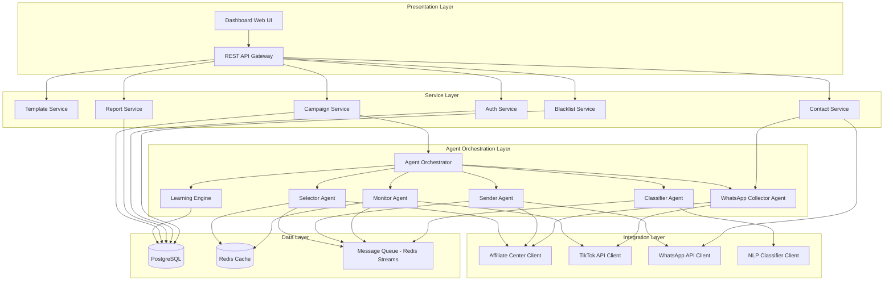
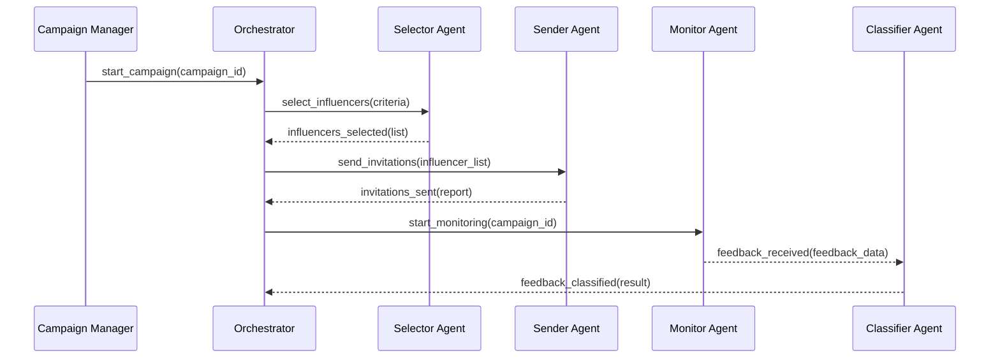

# Dokumen Desain Teknis

## Sistem Agen Cerdas Pemasaran Influencer TikTok

---

## Overview

Sistem Agen Cerdas Pemasaran Influencer TikTok adalah platform otomasi pemasaran berbasis Python yang mengintegrasikan TikTok API, WhatsApp API, dan Affiliate Center Indonesia untuk mengelola siklus hidup kampanye influencer secara end-to-end.

Sistem ini mengadopsi arsitektur multi-agen di mana setiap agen bertanggung jawab atas domain fungsional tertentu: seleksi influencer, pengiriman undangan, pemantauan konten, dan klasifikasi umpan balik. Agen-agen ini beroperasi secara asinkron dan terkoordinasi melalui message queue terpusat.

### Tujuan Utama

- Mengotomasi seluruh alur kerja pemasaran influencer dari seleksi hingga pelaporan
- Mengintegrasikan data real-time dari Affiliate Center Indonesia dan TikTok API
- Mengirimkan undangan massal melalui WhatsApp API dengan rate limiting yang aman
- Mengklasifikasikan umpan balik influencer secara otomatis menggunakan NLP
- Menyediakan dasbor terpusat untuk pemantauan dan analitik kampanye

---

## Architecture

### Gambaran Arsitektur

Sistem menggunakan arsitektur layered dengan pemisahan yang jelas antara lapisan presentasi, logika bisnis, integrasi, dan penyimpanan data.



### Pola Komunikasi Antar Agen

Agen-agen berkomunikasi secara asinkron melalui Redis Streams sebagai message queue. Setiap agen memiliki consumer group sendiri dan memproses pesan secara independen.



---

## Components and Interfaces

### 1. Agent Orchestrator

Komponen pusat yang mengkoordinasikan semua agen dan mengelola state kampanye.

```python
class AgentOrchestrator:
    async def start_campaign(self, campaign_id: str) -> CampaignResult
    async def stop_campaign(self, campaign_id: str) -> None
    async def get_campaign_status(self, campaign_id: str) -> CampaignStatus
    async def handle_agent_event(self, event: AgentEvent) -> None
```

### 2. Selector Agent

Bertanggung jawab memfilter dan menghitung skor relevansi influencer.

```python
class SelectorAgent:
    async def select_influencers(
        self,
        criteria: SelectionCriteria,
        campaign_id: str
    ) -> List[Influencer]

    async def calculate_relevance_score(
        self,
        influencer: Influencer,
        criteria: SelectionCriteria
    ) -> float

    async def save_criteria_template(
        self,
        template: CriteriaTemplate
    ) -> str
```

### 3. Sender Agent

Mengelola pengiriman undangan massal dengan rate limiting.

```python
class SenderAgent:
    async def send_bulk_invitations(
        self,
        influencers: List[Influencer],
        template_id: str,
        campaign_id: str,
        scheduled_at: Optional[datetime] = None
    ) -> InvitationReport

    async def send_single_invitation(
        self,
        influencer: Influencer,
        message: str,
        campaign_id: str
    ) -> InvitationResult
```

### 4. Monitor Agent

Memantau konten TikTok yang diterbitkan influencer secara periodik.

```python
class MonitorAgent:
    async def start_monitoring(self, campaign_id: str) -> None
    async def stop_monitoring(self, campaign_id: str) -> None
    async def check_new_content(self, campaign_id: str) -> List[ContentMetrics]
    async def validate_affiliate_link(
        self,
        content: TikTokContent,
        campaign_id: str
    ) -> bool
    async def generate_final_report(self, campaign_id: str) -> CampaignReport
```

### 5. Classifier Agent

Mengklasifikasikan umpan balik influencer menggunakan NLP.

```python
class ClassifierAgent:
    async def classify_feedback(
        self,
        feedback: InfluencerFeedback
    ) -> ClassificationResult

    async def get_classification_summary(
        self,
        campaign_id: str
    ) -> ClassificationSummary
```

### 6. WhatsApp Number Collector Agent

Mengumpulkan nomor WhatsApp affiliate secara otomatis melalui tiga metode bertingkat: pemeriksaan ikon resmi, parsing bio, dan pesan chat otomatis.

```python
class WhatsAppCollectorAgent:
    async def collect_whatsapp_number(
        self,
        affiliate_id: str
    ) -> WhatsAppCollectionResult

    async def check_official_whatsapp_icon(
        self,
        affiliate_id: str
    ) -> Optional[str]
    """
    Memeriksa ikon/tombol WhatsApp resmi di profil affiliate
    via TikTok Seller Center API.
    Mengembalikan nomor WA jika ditemukan, None jika tidak.
    """

    async def parse_bio_for_whatsapp(
        self,
        bio_text: str
    ) -> Optional[str]
    """
    Mem-parse teks bio affiliate menggunakan regex untuk mendeteksi
    pola nomor WA: wa.me/628xxx, +62812xxx, WA: 0812xxx, 0812xxx, dll.
    Mengembalikan nomor raw jika ditemukan, None jika tidak.
    """

    async def send_chat_request(
        self,
        affiliate_id: str
    ) -> str
    """
    Mengirim pesan otomatis via chat TikTok Seller Center
    menanyakan nomor WhatsApp. Mengembalikan chat_message_id.
    """

    async def monitor_chat_reply(
        self,
        affiliate_id: str,
        chat_message_id: str,
        timeout_hours: int = 48
    ) -> Optional[str]
    """
    Memantau balasan chat dan mengekstrak nomor WA dari teks balasan.
    Mengembalikan nomor raw jika ditemukan dalam timeout, None jika tidak.
    """

    def normalize_to_e164(
        self,
        raw_number: str
    ) -> str
    """
    Menormalisasi berbagai format nomor Indonesia ke format E.164 (+62xxx).
    Mendukung: 08xxx, +628xxx, 628xxx, wa.me/628xxx, WA: 08xxx.
    """

    def validate_whatsapp_number(
        self,
        phone_number: str
    ) -> bool
    """
    Memvalidasi bahwa nomor dalam format E.164 dan merupakan
    nomor Indonesia yang valid (+62 diikuti 9-12 digit).
    """

    async def save_collection_record(
        self,
        affiliate_id: str,
        phone_number: str,
        method: WhatsAppCollectionMethod,
    ) -> WhatsAppCollectionRecord
    """
    Menyimpan nomor ke profil influencer dan mencatat metode
    serta timestamp pengumpulan.
    """

    async def mark_unavailable(
        self,
        affiliate_id: str,
        reason: str
    ) -> None
    """
    Menandai status pengumpulan sebagai tidak_tersedia
    jika semua metode gagal atau timeout.
    """
```

### 7. Affiliate Search Dashboard

Komponen dashboard untuk pencarian, filter, dan tampilan detail affiliate, serta pemilihan kanal kontak otomatis.

#### Logika Pemilihan Kanal Kontak

```
Affiliate memiliki phone_number di DB?
    ├── YA  → Tampilkan tombol "Kirim via WhatsApp" → gunakan WhatsApp API
    └── TIDAK → Tampilkan tombol "Tanya Nomor WA via Chat"
                → trigger WhatsAppCollectorAgent (ikon → bio → chat)
```

#### Komponen UI

- **Panel Pencarian**: Form filter dengan field `min_followers`, `max_followers`, `min_engagement_rate`, `categories`, `locations`
- **Daftar Hasil**: Kartu affiliate menampilkan nama, foto, follower count, engagement rate, dan status ketersediaan WhatsApp
- **Panel Detail Affiliate**: Semua data affiliate, tombol aksi kontak sesuai ketersediaan nomor WA

### 8. Learning Engine (Self-Improving AI Agent)

Komponen pembelajaran berkelanjutan yang memperbarui model seleksi dan klasifikasi berdasarkan data historis kampanye.

```python
# app/agents/learning_engine.py
class LearningEngine:
    async def record_campaign_outcome(self, campaign_id: str) -> None
    """
    Dipanggil otomatis oleh Orchestrator saat kampanye selesai.
    Mengambil data performa (GMV, conversion_rate, acceptance_rate)
    dan menyimpannya sebagai CampaignOutcome untuk digunakan retraining.
    """

    async def retrain_selection_model(self) -> ModelVersion
    """
    Melatih ulang model seleksi menggunakan semua CampaignOutcome yang tersimpan.
    Influencer dengan GMV tinggi dan conversion_rate tinggi mendapat bobot lebih tinggi.
    Berjalan sebagai background task (async). Mengembalikan ModelVersion baru.
    """

    async def retrain_classifier_model(self) -> ModelVersion
    """
    Melatih ulang model klasifikasi menggunakan data umpan balik yang telah
    diklasifikasikan, termasuk hasil tinjauan manual.
    Berjalan sebagai background task (async). Mengembalikan ModelVersion baru.
    """

    async def get_influencer_recommendations(
        self,
        criteria: SelectionCriteria,
        top_n: int
    ) -> List[InfluencerRecommendation]
    """
    Menghasilkan rekomendasi influencer berdasarkan model seleksi terkini
    dan pola data historis kampanye.
    """

    async def get_model_performance_history(self) -> List[ModelVersion]
    """
    Mengembalikan riwayat semua versi model yang pernah dilatih,
    diurutkan dari terbaru ke terlama.
    """
```

### 9. REST API Gateway

Antarmuka HTTP untuk dashboard dan integrasi eksternal.

```
POST   /api/v1/campaigns                    - Buat kampanye baru
GET    /api/v1/campaigns/{id}               - Detail kampanye
POST   /api/v1/campaigns/{id}/start         - Mulai kampanye
POST   /api/v1/campaigns/{id}/stop          - Hentikan kampanye
GET    /api/v1/campaigns/{id}/status        - Status kampanye
GET    /api/v1/campaigns/{id}/report        - Laporan kampanye

POST   /api/v1/influencers/select           - Seleksi influencer
GET    /api/v1/influencers/blacklist        - Daftar hitam
POST   /api/v1/influencers/blacklist        - Tambah ke daftar hitam
DELETE /api/v1/influencers/blacklist/{id}   - Hapus dari daftar hitam

GET    /api/v1/affiliates/search            - Pencarian affiliate (Req. 12)
GET    /api/v1/affiliates/{id}              - Detail affiliate (Req. 12)
POST   /api/v1/affiliates/{id}/contact      - Kirim pesan ke affiliate (Req. 12)

POST   /api/v1/templates                    - Buat template
GET    /api/v1/templates                    - Daftar template
PUT    /api/v1/templates/{id}               - Update template
DELETE /api/v1/templates/{id}               - Hapus template

GET    /api/v1/reports/campaigns            - Laporan kampanye
POST   /api/v1/reports/export               - Ekspor laporan

GET    /api/v1/learning/recommendations     - Rekomendasi influencer (Req. 13)
GET    /api/v1/learning/model-history       - Riwayat versi model (Req. 13)

POST   /api/v1/auth/login                   - Login
POST   /api/v1/auth/logout                  - Logout
POST   /api/v1/auth/refresh                 - Refresh token
```

#### Detail Endpoint Affiliate Search (Requirement 12)

```
GET /api/v1/affiliates/search
Query params:
  - min_followers: int (opsional)
  - max_followers: int (opsional)
  - min_engagement_rate: float (opsional)
  - categories: str[] (opsional, multi-value)
  - locations: str[] (opsional, multi-value)
  - page: int (default: 1)
  - page_size: int (default: 20, max: 100)

Response: PaginatedResult[AffiliateCard]

GET /api/v1/affiliates/{id}
Response: AffiliateDetail (semua field + contact_channel)

POST /api/v1/affiliates/{id}/contact
Body: { "message": str }
Logika:
  - Jika phone_number tersimpan → kirim via WhatsApp API
  - Jika tidak → trigger WhatsAppCollectorAgent.collect_whatsapp_number()
Response: { "channel": "whatsapp" | "seller_center_chat", "status": str }
```

### 10. Integration Clients

#### Affiliate Center Client
```python
class AffiliateCenterClient:
    async def authenticate(self) -> OAuthToken
    async def refresh_token(self, token: OAuthToken) -> OAuthToken
    async def get_influencers(
        self,
        page: int,
        page_size: int = 100,
        filters: Optional[Dict] = None
    ) -> PaginatedResult[Influencer]
    async def sync_influencer_data(self, since: datetime) -> List[Influencer]
```

#### TikTok API Client
```python
class TikTokAPIClient:
    async def get_user_videos(
        self,
        user_id: str,
        since: datetime
    ) -> List[TikTokContent]
    async def get_video_metrics(self, video_id: str) -> VideoMetrics
```

#### WhatsApp API Client
```python
class WhatsAppAPIClient:
    async def send_message(
        self,
        phone_number: str,
        message: str
    ) -> MessageResult
    async def get_message_status(self, message_id: str) -> MessageStatus
```

---

## Data Models

### Campaign

```python
@dataclass
class Campaign:
    id: str                          # UUID
    name: str
    description: str
    status: CampaignStatus           # DRAFT, ACTIVE, PAUSED, COMPLETED
    selection_criteria_id: str
    template_id: str
    start_date: datetime
    end_date: datetime
    created_by: str                  # user_id
    created_at: datetime
    updated_at: datetime
    settings: CampaignSettings

@dataclass
class CampaignSettings:
    max_invitations_per_minute: int = 100
    monitoring_interval_minutes: int = 30
    compliance_check_enabled: bool = True
    alert_thresholds: Dict[str, float] = field(default_factory=dict)

class CampaignStatus(str, Enum):
    DRAFT = "DRAFT"
    ACTIVE = "ACTIVE"
    PAUSED = "PAUSED"
    COMPLETED = "COMPLETED"
```

### Influencer

```python
@dataclass
class Influencer:
    id: str                          # ID dari Affiliate Center
    tiktok_user_id: str
    name: str
    phone_number: str                # Untuk WhatsApp
    follower_count: int
    engagement_rate: float           # 0.0 - 1.0
    content_categories: List[str]
    location: str
    relevance_score: Optional[float] = None
    status: InfluencerStatus = InfluencerStatus.ACTIVE
    blacklisted: bool = False
    blacklist_reason: Optional[str] = None

class InfluencerStatus(str, Enum):
    ACTIVE = "ACTIVE"
    INVITED = "INVITED"
    ACCEPTED = "ACCEPTED"
    REJECTED = "REJECTED"
    BLACKLISTED = "BLACKLISTED"
```

### SelectionCriteria

```python
@dataclass
class SelectionCriteria:
    id: str
    name: str
    min_followers: Optional[int] = None
    max_followers: Optional[int] = None
    min_engagement_rate: Optional[float] = None
    content_categories: Optional[List[str]] = None
    locations: Optional[List[str]] = None
    criteria_weights: CriteriaWeights = field(default_factory=CriteriaWeights)
    is_template: bool = False

@dataclass
class CriteriaWeights:
    follower_count: float = 0.3
    engagement_rate: float = 0.4
    category_match: float = 0.2
    location_match: float = 0.1
```

### Invitation

```python
@dataclass
class Invitation:
    id: str
    campaign_id: str
    influencer_id: str
    template_id: str
    message_content: str             # Pesan setelah substitusi variabel
    status: InvitationStatus
    sent_at: Optional[datetime] = None
    scheduled_at: Optional[datetime] = None
    error_message: Optional[str] = None
    whatsapp_message_id: Optional[str] = None

class InvitationStatus(str, Enum):
    PENDING = "PENDING"
    SCHEDULED = "SCHEDULED"
    SENT = "SENT"
    FAILED = "FAILED"
    DELIVERED = "DELIVERED"
```

### ContentMetrics

```python
@dataclass
class ContentMetrics:
    id: str
    campaign_id: str
    influencer_id: str
    tiktok_video_id: str
    views: int
    likes: int
    comments: int
    shares: int
    has_valid_affiliate_link: bool
    gmv_generated: float
    conversion_rate: float
    recorded_at: datetime
    is_compliant: bool
```

### InfluencerFeedback

```python
@dataclass
class InfluencerFeedback:
    id: str
    campaign_id: str
    influencer_id: str
    invitation_id: str
    raw_message: str
    classification: Optional[FeedbackCategory] = None
    confidence_score: Optional[float] = None
    requires_manual_review: bool = False
    classified_at: Optional[datetime] = None
    received_at: datetime = field(default_factory=datetime.utcnow)

class FeedbackCategory(str, Enum):
    ACCEPTED = "Menerima"
    REJECTED = "Menolak"
    NEEDS_MORE_INFO = "Membutuhkan_Informasi_Lebih_Lanjut"
    NO_RESPONSE = "Tidak_Merespons"
```

### MessageTemplate

```python
@dataclass
class MessageTemplate:
    id: str
    name: str
    content: str                     # Konten dengan variabel {{variable_name}}
    variables: List[str]             # Daftar variabel yang digunakan
    default_values: Dict[str, str]   # Nilai default untuk setiap variabel
    version: int
    is_active: bool
    campaign_ids: List[str]          # Kampanye yang menggunakan template ini
    created_at: datetime
    updated_at: datetime
```

### WhatsAppCollectionRecord

```python
class WhatsAppCollectionMethod(str, Enum):
    OFFICIAL_ICON = "official_icon"       # Ditemukan via ikon resmi TikTok Seller Center
    BIO_PARSING   = "bio_parsing"         # Ditemukan via regex parsing teks bio
    CHAT_REPLY    = "chat_reply"          # Ditemukan via balasan pesan chat otomatis

class WhatsAppCollectionStatus(str, Enum):
    COLLECTED    = "collected"            # Nomor berhasil dikumpulkan dan tersimpan
    UNAVAILABLE  = "unavailable"          # Semua metode gagal / timeout 48 jam
    PENDING_CHAT = "pending_chat"         # Menunggu balasan chat (belum timeout)

@dataclass
class WhatsAppCollectionRecord:
    id: str                               # UUID
    affiliate_id: str                     # ID affiliate di TikTok Seller Center
    influencer_id: str                    # ID influencer di database lokal
    phone_number: Optional[str]           # Nomor dalam format E.164 (+62xxx), None jika unavailable
    method: Optional[WhatsAppCollectionMethod]  # Metode yang berhasil digunakan
    status: WhatsAppCollectionStatus
    chat_message_id: Optional[str]        # ID pesan chat jika metode chat digunakan
    raw_extracted: Optional[str]          # Teks nomor mentah sebelum normalisasi
    collected_at: Optional[datetime]      # Timestamp saat nomor berhasil dikumpulkan
    chat_sent_at: Optional[datetime]      # Timestamp saat pesan chat dikirim
    timeout_at: Optional[datetime]        # Timestamp batas waktu tunggu balasan chat
    created_at: datetime = field(default_factory=datetime.utcnow)
    updated_at: datetime = field(default_factory=datetime.utcnow)

@dataclass
class WhatsAppCollectionResult:
    affiliate_id: str
    phone_number: Optional[str]           # None jika tidak berhasil dikumpulkan
    method: Optional[WhatsAppCollectionMethod]
    status: WhatsAppCollectionStatus
    record: WhatsAppCollectionRecord
```

### AffiliateCard & AffiliateDetail (Requirement 12)

```python
@dataclass
class AffiliateCard:
    id: str
    name: str
    photo_url: Optional[str]
    follower_count: int
    engagement_rate: float
    content_categories: List[str]
    location: str
    has_whatsapp: bool               # True jika phone_number tersimpan di DB

@dataclass
class AffiliateDetail:
    id: str
    name: str
    photo_url: Optional[str]
    follower_count: int
    engagement_rate: float
    content_categories: List[str]
    location: str
    bio: Optional[str]
    phone_number: Optional[str]      # Format E.164, None jika belum dikumpulkan
    contact_channel: str             # "whatsapp" | "seller_center_chat"
    whatsapp_collection_status: Optional[WhatsAppCollectionStatus]
    tiktok_profile_url: Optional[str]
```

### ModelVersion, InfluencerRecommendation, CampaignOutcome (Requirement 13)

```python
class ModelType(str, Enum):
    SELECTION   = "SELECTION"     # Model untuk seleksi/rekomendasi influencer
    CLASSIFIER  = "CLASSIFIER"    # Model untuk klasifikasi umpan balik

@dataclass
class ModelVersion:
    id: str                          # UUID
    model_type: ModelType
    version: int                     # Bertambah monoton per model_type
    accuracy_before: Optional[float] # Akurasi sebelum retraining (None untuk versi pertama)
    accuracy_after: float            # Akurasi setelah retraining
    trained_at: datetime
    training_data_size: int          # Jumlah data yang digunakan untuk training

@dataclass
class InfluencerRecommendation:
    influencer_id: str
    predicted_conversion_rate: float  # [0.0, 1.0]
    predicted_gmv: float              # Estimasi GMV dalam IDR
    confidence_score: float           # [0.0, 1.0]
    based_on_campaigns: List[str]     # campaign_id yang menjadi dasar prediksi

@dataclass
class CampaignOutcome:
    id: str                          # UUID
    campaign_id: str
    influencer_id: str
    accepted: bool                   # Apakah influencer menerima undangan
    gmv_generated: float             # Total GMV yang dihasilkan
    conversion_rate: float           # [0.0, 1.0]
    content_count: int               # Jumlah konten yang dipublikasikan
    recorded_at: datetime
```

### User & RBAC

```python
@dataclass
class User:
    id: str
    username: str
    password_hash: str
    role: UserRole
    is_active: bool
    failed_login_attempts: int = 0
    locked_until: Optional[datetime] = None
    last_activity_at: Optional[datetime] = None

class UserRole(str, Enum):
    ADMINISTRATOR = "Administrator"
    CAMPAIGN_MANAGER = "Manajer_Kampanye"
    REVIEWER = "Peninjau"
```

### Skema Database (PostgreSQL)

```sql
-- Tabel utama
campaigns, influencers, invitations, content_metrics,
influencer_feedback, message_templates, template_versions,
blacklist, users, audit_logs, selection_criteria,
whatsapp_collection_records,
campaign_outcomes, model_versions

-- Indeks penting
CREATE INDEX idx_invitations_campaign_id ON invitations(campaign_id);
CREATE INDEX idx_content_metrics_campaign_influencer ON content_metrics(campaign_id, influencer_id);
CREATE INDEX idx_feedback_campaign_id ON influencer_feedback(campaign_id);
CREATE INDEX idx_audit_logs_user_id ON audit_logs(user_id, created_at);
CREATE INDEX idx_wa_collection_affiliate ON whatsapp_collection_records(affiliate_id);
CREATE INDEX idx_wa_collection_status ON whatsapp_collection_records(status);
CREATE INDEX idx_campaign_outcomes_influencer ON campaign_outcomes(influencer_id);
CREATE INDEX idx_model_versions_type_version ON model_versions(model_type, version);
```

---


## Correctness Properties

*A property is a characteristic or behavior that should hold true across all valid executions of a system — essentially, a formal statement about what the system should do. Properties serve as the bridge between human-readable specifications and machine-verifiable correctness guarantees.*

### Property 1: Retry Koneksi Tepat 3 Kali

*For any* kegagalan koneksi ke Affiliate Center, sistem harus melakukan percobaan ulang tepat 3 kali sebelum mengembalikan error, tidak lebih dan tidak kurang.

**Validates: Requirements 1.2**

---

### Property 2: Token Refresh Transparan

*For any* request yang dilakukan dengan token yang sudah kedaluwarsa, sistem harus secara otomatis memperbarui token dan menyelesaikan request tanpa mengembalikan error autentikasi ke pemanggil.

**Validates: Requirements 1.4**

---

### Property 3: Pagination Tidak Melebihi Batas

*For any* permintaan daftar influencer ke Affiliate Center, setiap halaman yang dikembalikan tidak boleh mengandung lebih dari 100 item.

**Validates: Requirements 1.5**

---

### Property 4: Hasil Seleksi Memenuhi Semua Kriteria

*For any* konfigurasi kriteria seleksi dan dataset influencer, setiap influencer yang dikembalikan oleh Selector Agent harus memenuhi semua kriteria yang diterapkan (follower count, engagement rate, kategori, lokasi).

**Validates: Requirements 2.1**

---

### Property 5: Skor Relevansi Konsisten dan Terbatas

*For any* influencer dan konfigurasi bobot kriteria, skor relevansi yang dihitung harus berada dalam rentang [0.0, 1.0] dan menghasilkan nilai yang sama untuk input yang sama (deterministik).

**Validates: Requirements 2.3**

---

### Property 6: Template Kriteria Round-Trip

*For any* konfigurasi kriteria seleksi yang disimpan sebagai template, mengambil kembali template tersebut harus menghasilkan data yang identik dengan data yang disimpan.

**Validates: Requirements 2.6**

---

### Property 7: Semua Influencer Terpilih Menerima Undangan

*For any* daftar influencer yang dipilih (tidak di-blacklist), setelah proses pengiriman massal selesai, setiap influencer dalam daftar harus memiliki catatan undangan dengan status SENT atau FAILED (tidak ada yang terlewat).

**Validates: Requirements 3.1**

---

### Property 8: Rate Limiting Undangan

*For any* proses pengiriman undangan massal, jumlah undangan yang dikirim dalam satu menit tidak boleh melebihi 100.

**Validates: Requirements 3.2**

---

### Property 9: Pencatatan Status Pengiriman Lengkap

*For any* undangan yang diproses (berhasil maupun gagal), sistem harus mencatat status pengiriman beserta timestamp yang valid. Total undangan berhasil + gagal + tertunda harus sama dengan total influencer yang diproses.

**Validates: Requirements 3.3, 3.6**

---

### Property 10: Kegagalan Satu Tidak Menghentikan Proses

*For any* daftar influencer di mana sebagian pengiriman gagal, influencer yang gagal harus dicatat sebagai FAILED dan pengiriman kepada influencer lainnya harus tetap dilanjutkan.

**Validates: Requirements 3.4**

---

### Property 11: Substitusi Variabel Template Lengkap

*For any* template pesan dengan variabel dinamis dan data influencer yang valid, pesan yang dihasilkan tidak boleh mengandung placeholder variabel yang belum disubstitusi (format `{{variable_name}}`).

**Validates: Requirements 3.5**

---

### Property 12: Metrik Konten Lengkap

*For any* konten TikTok yang diproses oleh Monitor Agent, semua metrik yang diperlukan (views, likes, comments, shares) harus diekstrak dan tidak boleh bernilai null atau negatif.

**Validates: Requirements 4.2**

---

### Property 13: Deteksi Tautan Afiliasi Konsisten

*For any* konten TikTok, fungsi deteksi tautan afiliasi harus mengembalikan True jika dan hanya jika konten mengandung tautan afiliasi yang valid sesuai kampanye yang berjalan.

**Validates: Requirements 4.3**

---

### Property 14: Riwayat Metrik Tersimpan Per Hari

*For any* metrik konten yang dicatat, mengambil riwayat metrik untuk tanggal tertentu harus mengembalikan semua metrik yang dicatat pada tanggal tersebut.

**Validates: Requirements 4.5**

---

### Property 15: Laporan Akhir Mencakup Semua Influencer

*For any* kampanye yang telah berakhir, laporan performa akhir harus mengandung data untuk setiap influencer yang berpartisipasi, termasuk total tayangan, GMV, dan tingkat konversi.

**Validates: Requirements 4.6**

---

### Property 16: Klasifikasi Menghasilkan Kategori Valid

*For any* umpan balik influencer yang diproses, hasil klasifikasi harus berupa salah satu dari empat kategori yang valid: Menerima, Menolak, Membutuhkan_Informasi_Lebih_Lanjut, atau Tidak_Merespons.

**Validates: Requirements 5.1**

---

### Property 17: Routing ke Manual Review

*For any* umpan balik yang diklasifikasikan sebagai Membutuhkan_Informasi_Lebih_Lanjut ATAU memiliki confidence_score di bawah 0.8, field `requires_manual_review` harus bernilai True.

**Validates: Requirements 5.3, 5.4**

---

### Property 18: Konsistensi Ringkasan Klasifikasi

*For any* kampanye, total semua kategori dalam ringkasan distribusi klasifikasi harus sama dengan total umpan balik yang telah diklasifikasikan untuk kampanye tersebut.

**Validates: Requirements 5.5**

---

### Property 19: Update Status Influencer Setelah Penolakan

*For any* umpan balik yang diklasifikasikan sebagai Menolak, status influencer tersebut dalam kampanye harus diperbarui menjadi REJECTED secara otomatis.

**Validates: Requirements 5.6**

---

### Property 20: Notifikasi Threshold Metrik

*For any* metrik kampanye yang melampaui ambang batas yang dikonfigurasi, sistem harus menghasilkan notifikasi peringatan yang berisi informasi metrik dan nilai ambang batas yang dilanggar.

**Validates: Requirements 6.4**

---

### Property 21: Ekspor Data Lengkap

*For any* data kampanye yang diekspor dalam format CSV atau Excel, file yang dihasilkan harus mengandung semua baris dan kolom yang sesuai dengan data yang ditampilkan di sistem.

**Validates: Requirements 6.5**

---

### Property 22: Validasi Variabel Template

*For any* template pesan yang disimpan, semua variabel dinamis yang dideklarasikan dalam konten template harus memiliki nilai default yang tidak kosong dalam `default_values`.

**Validates: Requirements 7.2**

---

### Property 23: Pratinjau Template Tersubstitusi

*For any* template pesan dan data influencer sampel, pratinjau yang dihasilkan harus mengandung nilai aktual (bukan placeholder) untuk semua variabel yang dideklarasikan.

**Validates: Requirements 7.4**

---

### Property 24: Riwayat Versi Template

*For any* pembaruan template pesan, versi sebelumnya harus tetap dapat diakses dan nomor versi harus bertambah secara monoton.

**Validates: Requirements 7.5**

---

### Property 25: Blacklist Round-Trip

*For any* influencer yang ditambahkan ke daftar hitam dengan alasan tertentu, mengambil data blacklist harus mengembalikan influencer tersebut beserta alasan yang sama persis.

**Validates: Requirements 8.1, 8.4**

---

### Property 26: Seleksi Mengecualikan Blacklist

*For any* proses seleksi influencer, tidak ada influencer yang terdapat dalam daftar hitam yang boleh muncul dalam hasil seleksi.

**Validates: Requirements 8.2**

---

### Property 27: Pengiriman Menolak Influencer Blacklist

*For any* percobaan pengiriman undangan kepada influencer yang ada dalam daftar hitam, sistem harus menolak pengiriman dan mengembalikan error yang menjelaskan alasan pemblokiran.

**Validates: Requirements 8.3**

---

### Property 28: Validasi Panjang Kata Sandi

*For any* kata sandi dengan panjang kurang dari 8 karakter, sistem harus menolak pembuatan atau perubahan kata sandi tersebut.

**Validates: Requirements 9.1**

---

### Property 29: Kontrol Akses Berbasis Peran

*For any* operasi yang dibatasi oleh peran tertentu, pengguna dengan peran yang tidak memiliki izin harus mendapatkan respons error 403 Forbidden.

**Validates: Requirements 9.2**

---

### Property 30: Audit Log untuk Setiap Operasi Kampanye

*For any* operasi pengelolaan kampanye atau pengiriman undangan yang dilakukan oleh pengguna, sistem harus membuat entri log audit yang mencatat user_id, jenis operasi, dan timestamp.

**Validates: Requirements 9.4**

---

### Property 31: Penguncian Akun Setelah 5 Kali Gagal Login

*For any* akun yang mengalami 5 kali percobaan login gagal berturut-turut, akun tersebut harus terkunci dan percobaan login berikutnya harus ditolak hingga periode kunci berakhir.

**Validates: Requirements 9.5**

---

### Property 32: Kelengkapan Laporan Performa

*For any* laporan performa kampanye yang dihasilkan, laporan harus mengandung semua metrik yang diperlukan: total influencer, tingkat penerimaan undangan, total tayangan, total GMV, dan biaya per konversi.

**Validates: Requirements 10.1**

---

### Property 33: Filter Laporan Konsisten

*For any* laporan yang difilter berdasarkan rentang tanggal, kategori influencer, atau status kampanye, semua data yang dikembalikan harus memenuhi semua kriteria filter yang diterapkan.

**Validates: Requirements 10.3**

---

### Property 34: Urutan Prioritas Metode Pengumpulan WhatsApp

*For any* profil affiliate, `WhatsAppCollectorAgent` harus selalu mencoba metode dalam urutan yang benar: (1) ikon resmi → (2) parsing bio → (3) pesan chat. Jika metode ke-N berhasil, metode ke-(N+1) tidak boleh dipanggil.

**Validates: Requirements 11.1, 11.2, 11.3, 11.5**

---

### Property 35: Normalisasi Nomor ke Format E.164

*For any* string yang merepresentasikan nomor telepon Indonesia dalam format apapun yang valid (08xxx, +628xxx, 628xxx, wa.me/628xxx, WA: 08xxx, WA:08xxx), fungsi `normalize_to_e164` harus menghasilkan string dengan format `+62` diikuti digit yang sama.

**Validates: Requirements 11.4, 11.6**

---

### Property 36: Hanya Nomor Valid yang Tersimpan ke Database

*For any* nomor yang diekstrak dari ketiga metode pengumpulan, sistem hanya boleh menyimpan nomor ke database jika nomor tersebut lolos validasi format E.164 Indonesia (+62 diikuti 9–12 digit). Nomor yang tidak valid harus ditolak dan tidak tersimpan.

**Validates: Requirements 11.10**

---

### Property 37: Pencatatan Metode dan Timestamp Selalu Lengkap

*For any* pengumpulan nomor WhatsApp yang berhasil (status COLLECTED), record yang tersimpan harus selalu mengandung field `method` yang tidak null dan `collected_at` yang merupakan timestamp valid (tidak null, tidak di masa depan).

**Validates: Requirements 11.7**

---

### Property 38: Timeout Chat Menghasilkan Status Unavailable

*For any* affiliate yang tidak membalas pesan chat dalam 48 jam, status `WhatsAppCollectionRecord` harus diperbarui menjadi `unavailable` dan field `phone_number` harus bernilai null.

**Validates: Requirements 11.9**

---

### Property 39: Nomor Tersimpan Digunakan oleh Sender

*For any* influencer yang memiliki `WhatsAppCollectionRecord` dengan status `COLLECTED`, ketika `SenderAgent` mengirim undangan kepada influencer tersebut, nomor tujuan pengiriman harus sama dengan `phone_number` yang tersimpan di record.

**Validates: Requirements 11.8**

---

### Property 40: Hasil Pencarian Affiliate Memenuhi Semua Kriteria

*For any* kombinasi kriteria pencarian affiliate (min_followers, max_followers, min_engagement_rate, categories, locations) dan dataset affiliate, setiap affiliate yang dikembalikan oleh endpoint pencarian harus memenuhi semua kriteria yang diterapkan.

**Validates: Requirements 12.1, 12.2**

---

### Property 41: Detail Affiliate Mengandung Semua Field

*For any* affiliate yang valid dalam database, endpoint `GET /api/v1/affiliates/{id}` harus mengembalikan response yang mengandung semua field yang diperlukan: id, name, follower_count, engagement_rate, content_categories, location, contact_channel, dan whatsapp_collection_status.

**Validates: Requirements 12.3**

---

### Property 42: Pemilihan Kanal Kontak Berdasarkan Ketersediaan Nomor WA

*For any* affiliate, jika `phone_number` tersimpan di database (tidak null), maka `contact_channel` harus bernilai `"whatsapp"`. Jika `phone_number` null, maka `contact_channel` harus bernilai `"seller_center_chat"`. Tidak ada kondisi lain yang valid.

**Validates: Requirements 12.4, 12.5**

---

### Property 43: Versi Model Bertambah Monoton

*For any* dua `ModelVersion` dengan `model_type` yang sama, versi yang dibuat lebih baru harus memiliki `version` yang lebih besar dari versi yang dibuat sebelumnya. Tidak ada dua `ModelVersion` dengan `model_type` yang sama yang boleh memiliki `version` yang sama.

**Validates: Requirements 13.6**

---

### Property 44: Retraining Menghasilkan ModelVersion Lengkap

*For any* pemanggilan `retrain_selection_model()` atau `retrain_classifier_model()`, `ModelVersion` yang dikembalikan harus memiliki semua field wajib tidak null: `id`, `model_type`, `version`, `accuracy_after`, `trained_at`, dan `training_data_size` > 0.

**Validates: Requirements 13.1, 13.3, 13.6**

---

### Property 45: Confidence Score Rekomendasi dalam Rentang Valid

*For any* pemanggilan `get_influencer_recommendations()` dengan kriteria apapun, setiap `InfluencerRecommendation` yang dikembalikan harus memiliki `confidence_score` dalam rentang [0.0, 1.0] dan `predicted_conversion_rate` dalam rentang [0.0, 1.0].

**Validates: Requirements 13.4**

---

### Property 46: Retraining Tidak Mengubah State Kampanye Aktif

*For any* kampanye dengan status `ACTIVE`, menjalankan `retrain_selection_model()` atau `retrain_classifier_model()` secara bersamaan tidak boleh mengubah status, data influencer, atau undangan yang terkait dengan kampanye tersebut.

**Validates: Requirements 13.5**

---


## Error Handling

### Strategi Penanganan Error

Sistem menggunakan hierarki exception yang terdefinisi dengan baik dan pola retry yang konsisten.

```python
# Hierarki Exception
class TikTokAgentError(Exception): pass
class IntegrationError(TikTokAgentError): pass
class AffiliateCenterError(IntegrationError): pass
class TikTokAPIError(IntegrationError): pass
class WhatsAppAPIError(IntegrationError): pass
class AuthenticationError(TikTokAgentError): pass
class TokenExpiredError(AuthenticationError): pass
class RateLimitError(IntegrationError): pass
class ValidationError(TikTokAgentError): pass
class BlacklistViolationError(ValidationError): pass
class ClassificationError(TikTokAgentError): pass
class WhatsAppCollectionError(TikTokAgentError): pass
class InvalidPhoneNumberError(WhatsAppCollectionError): pass
class ChatTimeoutError(WhatsAppCollectionError): pass
class LearningEngineError(TikTokAgentError): pass
class ModelTrainingError(LearningEngineError): pass
```

### Pola Retry dengan Exponential Backoff

```python
@retry(
    stop=stop_after_attempt(3),
    wait=wait_fixed(5),
    retry=retry_if_exception_type(IntegrationError),
    reraise=True
)
async def call_affiliate_center(self, ...): ...
```

### Penanganan Error Per Komponen

| Komponen | Jenis Error | Penanganan |
|---|---|---|
| AffiliateCenterClient | Koneksi gagal | Retry 3x interval 5 detik |
| AffiliateCenterClient | Token expired | Auto-refresh token |
| SenderAgent | Pengiriman gagal | Catat FAILED, lanjutkan ke berikutnya |
| SenderAgent | Blacklist violation | Tolak, kembalikan BlacklistViolationError |
| ClassifierAgent | Confidence rendah | Set requires_manual_review = True |
| MonitorAgent | Konten tidak valid | Kirim notifikasi ke manajer |
| AuthService | Login gagal 5x | Kunci akun 15 menit |
| WhatsAppCollectorAgent | Nomor tidak valid | Tolak penyimpanan, lempar InvalidPhoneNumberError |
| WhatsAppCollectorAgent | Timeout balasan chat 48 jam | Set status unavailable, catat di log |
| WhatsAppCollectorAgent | Semua metode gagal | Set status unavailable, catat metode yang dicoba |
| LearningEngine | Tidak ada data outcome | Lewati retraining, log peringatan |
| LearningEngine | Retraining gagal | Lempar ModelTrainingError, pertahankan versi model sebelumnya |

### Circuit Breaker

Untuk integrasi eksternal (TikTok API, WhatsApp API, Affiliate Center), sistem mengimplementasikan circuit breaker pattern:
- **Closed**: Operasi normal
- **Open**: Setelah 5 kegagalan berturut-turut dalam 60 detik, tolak semua request selama 30 detik
- **Half-Open**: Izinkan 1 request percobaan, jika berhasil kembali ke Closed

---

## Testing Strategy

### Pendekatan Pengujian Ganda

Sistem menggunakan dua pendekatan pengujian yang saling melengkapi:

1. **Unit Tests**: Memverifikasi contoh spesifik, edge case, dan kondisi error
2. **Property-Based Tests**: Memverifikasi properti universal di seluruh input yang mungkin

### Library yang Digunakan

- **Property-Based Testing**: `hypothesis` (Python)
- **Unit Testing**: `pytest`
- **Async Testing**: `pytest-asyncio`
- **Mocking**: `unittest.mock`, `pytest-mock`
- **Coverage**: `pytest-cov`

### Konfigurasi Property-Based Testing

```python
from hypothesis import given, settings, HealthCheck
from hypothesis import strategies as st

@settings(
    max_examples=100,
    suppress_health_check=[HealthCheck.too_slow]
)
@given(...)
def test_property_name(...): ...
```

Setiap property test harus dijalankan minimal **100 iterasi** untuk memastikan coverage yang memadai.

### Format Tag Property Test

Setiap property test harus diberi komentar referensi ke property dalam dokumen desain:

```python
# Feature: tiktok-influencer-marketing-agent, Property 4: Hasil Seleksi Memenuhi Semua Kriteria
@given(
    influencers=st.lists(influencer_strategy()),
    criteria=selection_criteria_strategy()
)
def test_selection_results_meet_all_criteria(influencers, criteria):
    ...
```

### Struktur Test

```
tests/
├── unit/
│   ├── test_selector_agent.py
│   ├── test_sender_agent.py
│   ├── test_monitor_agent.py
│   ├── test_classifier_agent.py
│   ├── test_whatsapp_collector_agent.py
│   ├── test_learning_engine.py
│   ├── test_template_service.py
│   ├── test_blacklist_service.py
│   ├── test_auth_service.py
│   └── test_report_service.py
├── property/
│   ├── test_selector_properties.py      # Properties 4, 5, 6, 26
│   ├── test_sender_properties.py        # Properties 7, 8, 9, 10, 11, 27
│   ├── test_monitor_properties.py       # Properties 12, 13, 14, 15
│   ├── test_classifier_properties.py    # Properties 16, 17, 18, 19
│   ├── test_integration_properties.py   # Properties 1, 2, 3
│   ├── test_template_properties.py      # Properties 22, 23, 24
│   ├── test_blacklist_properties.py     # Properties 25, 26, 27
│   ├── test_auth_properties.py          # Properties 28, 29, 30, 31
│   ├── test_report_properties.py        # Properties 32, 33
│   ├── test_whatsapp_collector_properties.py  # Properties 34, 35, 36, 37, 38, 39
│   ├── test_affiliate_search_properties.py    # Properties 40, 41, 42
│   └── test_learning_engine_properties.py     # Properties 43, 44, 45, 46
└── integration/
    ├── test_affiliate_center_integration.py
    ├── test_tiktok_api_integration.py
    └── test_whatsapp_api_integration.py
```

### Unit Tests: Fokus Area

Unit tests berfokus pada:
- **Contoh spesifik**: Verifikasi perilaku yang benar untuk input yang diketahui
- **Edge cases**: Dataset kosong, nilai null, string kosong, batas maksimum
- **Kondisi error**: Koneksi gagal, token expired, blacklist violation
- **Integrasi antar komponen**: Alur data dari satu agen ke agen lain

Contoh unit test untuk edge case:

```python
# Edge case: tidak ada influencer yang memenuhi kriteria (Requirement 2.5)
def test_empty_selection_returns_informative_message():
    criteria = SelectionCriteria(min_followers=10_000_000)  # Tidak realistis
    result = selector.select_influencers(criteria, dataset=[])
    assert result.influencers == []
    assert result.suggestion is not None
    assert len(result.suggestion) > 0

# Edge case: template dihapus saat digunakan kampanye aktif (Requirement 7.3)
def test_delete_active_template_raises_warning():
    template = create_template_used_by_active_campaign()
    with pytest.raises(TemplateInUseError):
        template_service.delete(template.id)
```

### Property Tests: Contoh Implementasi

```python
# Feature: tiktok-influencer-marketing-agent, Property 8: Rate Limiting Undangan
@settings(max_examples=100)
@given(
    influencer_count=st.integers(min_value=101, max_value=1000)
)
async def test_rate_limiting_max_100_per_minute(influencer_count):
    influencers = generate_influencers(influencer_count)
    sent_timestamps = []
    
    async def mock_send(influencer, message, campaign_id):
        sent_timestamps.append(datetime.utcnow())
        return InvitationResult(status=InvitationStatus.SENT)
    
    await sender_agent.send_bulk_invitations(influencers, template_id, campaign_id)
    
    # Verifikasi tidak ada 100+ undangan dalam window 60 detik manapun
    for i, ts in enumerate(sent_timestamps):
        window_end = ts + timedelta(seconds=60)
        count_in_window = sum(1 for t in sent_timestamps if ts <= t <= window_end)
        assert count_in_window <= 100

# Feature: tiktok-influencer-marketing-agent, Property 17: Routing ke Manual Review
@settings(max_examples=100)
@given(
    feedback=feedback_strategy(),
    confidence=st.floats(min_value=0.0, max_value=0.79)
)
async def test_low_confidence_routes_to_manual_review(feedback, confidence):
    feedback.confidence_score = confidence
    result = await classifier_agent.classify_feedback(feedback)
    assert result.requires_manual_review is True
```

### Strategi Generator untuk Hypothesis

```python
from hypothesis import strategies as st

@st.composite
def influencer_strategy(draw):
    return Influencer(
        id=draw(st.uuids()).hex,
        tiktok_user_id=draw(st.text(min_size=1, max_size=50)),
        name=draw(st.text(min_size=1, max_size=100)),
        phone_number=draw(st.from_regex(r'\+62[0-9]{9,12}')),
        follower_count=draw(st.integers(min_value=0, max_value=10_000_000)),
        engagement_rate=draw(st.floats(min_value=0.0, max_value=1.0)),
        content_categories=draw(st.lists(st.sampled_from(VALID_CATEGORIES))),
        location=draw(st.sampled_from(VALID_LOCATIONS)),
    )

@st.composite
def selection_criteria_strategy(draw):
    return SelectionCriteria(
        id=draw(st.uuids()).hex,
        name=draw(st.text(min_size=1)),
        min_followers=draw(st.one_of(st.none(), st.integers(min_value=0))),
        min_engagement_rate=draw(st.one_of(st.none(), st.floats(0.0, 1.0))),
        content_categories=draw(st.one_of(st.none(), st.lists(st.sampled_from(VALID_CATEGORIES)))),
    )
```

### Coverage Target

- Unit tests: minimal 80% line coverage
- Property tests: semua 46 correctness properties harus memiliki test yang sesuai
- Integration tests: semua endpoint API dan semua integrasi eksternal

### Property Tests: Contoh Implementasi WhatsApp Collector

```python
import re
from hypothesis import given, settings, strategies as st

# Strategi generator untuk format nomor Indonesia yang valid
wa_formats = st.one_of(
    st.from_regex(r'08[1-9][0-9]{7,10}', fullmatch=True),          # 08xxx
    st.from_regex(r'\+628[1-9][0-9]{7,10}', fullmatch=True),       # +628xxx
    st.from_regex(r'628[1-9][0-9]{7,10}', fullmatch=True),         # 628xxx
    st.from_regex(r'wa\.me/628[1-9][0-9]{7,10}', fullmatch=True),  # wa.me/628xxx
    st.from_regex(r'WA:?\s*08[1-9][0-9]{7,10}', fullmatch=True),   # WA: 08xxx
)

# Feature: tiktok-influencer-marketing-agent, Property 35: Normalisasi Nomor ke Format E.164
@settings(max_examples=200)
@given(raw_number=wa_formats)
def test_normalize_to_e164_always_produces_plus62(raw_number):
    collector = WhatsAppCollectorAgent()
    result = collector.normalize_to_e164(raw_number)
    assert result.startswith("+62"), f"Expected +62 prefix, got: {result}"
    # Digit setelah +62 harus sama dengan digit asli (tanpa prefix)
    digits_only = re.sub(r'\D', '', raw_number)
    if digits_only.startswith("62"):
        digits_only = digits_only[2:]
    elif digits_only.startswith("0"):
        digits_only = digits_only[1:]
    assert result == f"+62{digits_only}"

# Feature: tiktok-influencer-marketing-agent, Property 36: Hanya Nomor Valid yang Tersimpan
@settings(max_examples=100)
@given(invalid_number=st.text(min_size=1, max_size=20).filter(
    lambda s: not re.match(r'^\+62[1-9][0-9]{8,11}$', s)
))
async def test_invalid_number_not_saved(invalid_number):
    collector = WhatsAppCollectorAgent()
    with pytest.raises(InvalidPhoneNumberError):
        await collector.save_collection_record(
            affiliate_id="aff_123",
            phone_number=invalid_number,
            method=WhatsAppCollectionMethod.BIO_PARSING,
        )

# Feature: tiktok-influencer-marketing-agent, Property 34: Urutan Prioritas Metode
@settings(max_examples=100)
@given(affiliate=affiliate_with_official_icon_strategy())
async def test_priority_stops_at_official_icon(affiliate):
    collector = WhatsAppCollectorAgent()
    call_log = []

    async def mock_icon(aid): call_log.append("icon"); return "+62812345678"
    async def mock_bio(text): call_log.append("bio"); return None
    async def mock_chat(aid): call_log.append("chat"); return "msg_id"

    collector.check_official_whatsapp_icon = mock_icon
    collector.parse_bio_for_whatsapp = mock_bio
    collector.send_chat_request = mock_chat

    await collector.collect_whatsapp_number(affiliate.id)
    assert call_log == ["icon"], f"Metode lain tidak boleh dipanggil, log: {call_log}"

# Feature: tiktok-influencer-marketing-agent, Property 37: Pencatatan Metode dan Timestamp
@settings(max_examples=100)
@given(
    affiliate_id=st.uuids().map(str),
    method=st.sampled_from(list(WhatsAppCollectionMethod)),
    phone=st.from_regex(r'\+628[1-9][0-9]{8,10}', fullmatch=True),
)
async def test_collection_record_always_has_method_and_timestamp(affiliate_id, method, phone):
    collector = WhatsAppCollectorAgent()
    record = await collector.save_collection_record(
        affiliate_id=affiliate_id,
        phone_number=phone,
        method=method,
    )
    assert record.method is not None
    assert record.collected_at is not None
    assert record.collected_at <= datetime.utcnow()
    assert record.status == WhatsAppCollectionStatus.COLLECTED
```

